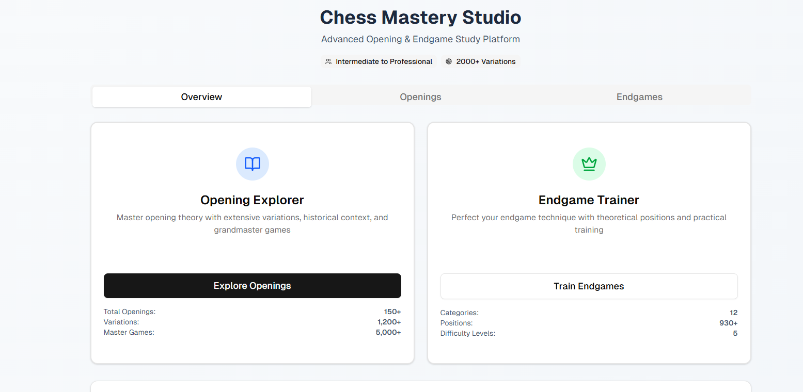
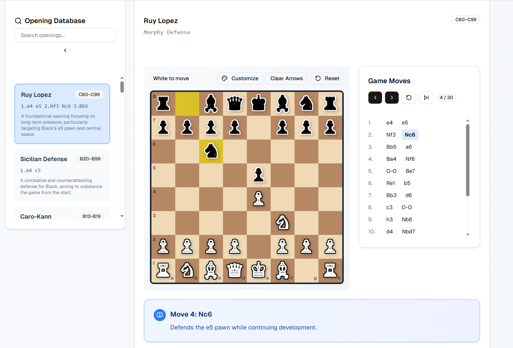

# ♟️ Chess Mastery Studio

A modern, interactive **Next.js + React + Tailwind CSS** chess application designed to help you **master chess openings and endgames**.  
Featuring the **top 25 most popular openings** with **20+ detailed variations each**, every move includes **human-readable explanations** to improve your understanding of chess strategy.

🔗 **Live Demo:** [Chess Mastery Studio](https://chess-mastery-studio.vercel.app/)

---

## 🚀 Features

- 📚 **Opening Database**  
  - 25 most popular chess openings (Ruy Lopez, Sicilian Defense, Caro-Kann, and more).  
  - 20+ variations for each opening.  
  - Each move is explained in plain language to teach *why* it’s played.

- 🎯 **Endgame Trainer**  
  - Practice key endgames like **queen vs king**, **rook vs king**, **two bishops vs king**, and more.  
  - Step-by-step move explanations to learn checkmating patterns.

- 🖥️ **Modern Chess Board**  
  - Built with **Next.js + React + Tailwind CSS**.  
  - Last move highlighting, arrows, and annotations.  
  - Clean, responsive UI that works seamlessly across devices.

- 📝 **Move Explanations**  
  - Every move has a tooltip-style explanation so you learn strategy as you play.  
  - Perfect for beginners and intermediate players wanting to understand theory.

- 🎨 **Customization**  
  - Customize arrows, reset positions, and freely explore openings.  
  - Light and minimal interface for distraction-free practice.

---

## 📸 Screenshots

### Opening Explorer


### Ruy Lopez Example


---

## 🛠️ Tech Stack

- **Framework:** [Next.js](https://nextjs.org/) (React + SSR)
- **Styling:** [Tailwind CSS](https://tailwindcss.com/)  
- **Chess Logic:** [chess.js](https://github.com/jhlywa/chess.js)  
- **UI Components:** Custom React components with move annotations  

---
## 📦 Installation

1. **Clone the repository**
   ```bash
   git clone https://github.com/DenizS4/Chess-Mastery-Studio.git
   cd Chess-Mastery-Studio
   npm install

2. **Install dependencies**
   ```bash
   npm install
   
3. **Run the project**
   ```bash
   npm run dev

4. **Open the project**
   ```bash
   http://localhost:3000

